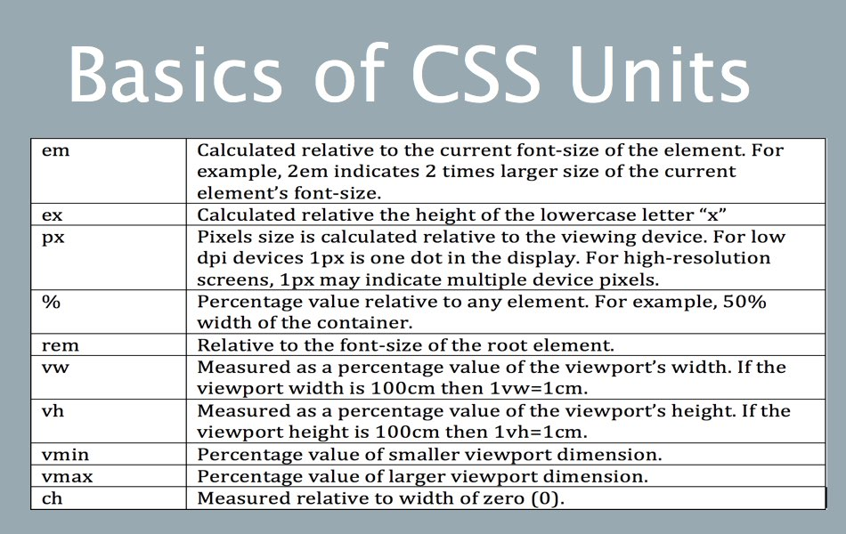

# lesson-three

# learning HTML and CSS

This session is going to be verbose. Which means there's less concepts and more keyword based coding. This is the nature of HTML/CSS, that you need to know the `right keyword`.

# how this works in industry?

The session is akin to how it works. You get a design, generally in Figma, sketch etc. And then you have to replicate that design using CSS.

Where new developers go wrong sometimes is not using the right semantic element for components, and thus, we'll cover that topic first.

# what are we making?

A component library which we'll use to develop our portfolio and other projects.

Think of it as your personal bootstrap or material design.

There are three code pieces w.r.t each component in our component-library.

The pieces are as follows:

1. The raw HTML code-piece
2. HTML + CSS
3. Pure CSS

# components we need in library

## typography

- headings
- paragraphs
- small text

```HTML
<h2>@typography</h2>

    <h1>This is the biggest heading</h1>
    <h2>This is the second biggest</h2>
    <p>
      This is normal text. This is free flowing & will wrap at end like a
      paragraph.
    </p>
    <small> This is relatively smaller text </small>
```

```HTML
<link rel="stylesheet" href="../styles.css" />

<h2>@typography</h2>

    <h1>This is the biggest heading</h1>
    <h2>This is the second biggest</h2>
    <p>
      This is normal text. This is free flowing & will wrap at end like a
      paragraph.
    </p>
    <p>This para will have a <strong>bold</strong> text</p>
    <small> This is relatively smaller text </small>
```

```CSS
/* typography */
@import url('https://fonts.googleapis.com/css2?family=Montserrat:wght@400;700&display=swap');

:root {
  --primary-color: #14B8A6;
  --dark-gray: #6B7280;
}

body {
  font-family: 'Montserrat', sans-serif;
}
```

## containers

- fluid container
- center container

```HTML
    <h2>@container</h2>

    <h3>fluid container</h3>
    <div>This is a fluid container & it will go till the end of the page</div>

    <h3>center container</h3>
    <div>
      This is a centered container and it will go till the specified width
    </div>

```

```HTML
<h2>@container</h2>

    <h3>fluid container</h3>
    <div class="container">
      This is a fluid container & it will go till the end of the page
    </div>

    <h3>center container</h3>
    <div class="container container-center">
      This is a centered container and it will go till the specified width
    </div>
```

```CSS
/* container */
.container {
  padding: 0 1rem;
}

.container-center {
  max-width: 600px;
  margin: auto;
}

```

## links

- primary link
- secondary link

```HTML
    <h2>@links</h2>

    <a href="/">Primary Link</a>
    <a href="/">Secondary Link</a>

```

```HTML
<h2>@links</h2>

    <a class="link link-primary" href="/">Primary Link</a>
    <a class="link link-secondary" href="/">Secondary Link</a>
```

```CSS
/* links */
.link {
  text-decoration: none;
  padding: 0.5rem 1rem;
}

.link-primary {
  background-color: var(--primary-color);
  border-radius: 0.5rem;
  color: white;
}

.link-secondary {
  color: var(--primary-color);
  border-radius: 0.5rem;
  border: 1px solid var(--primary-color);
}
```

## lists

- unordered lists (without bullets)
- inline lists
- reverse ordered lists

```HTML
<h2>@lists</h2>

    <h3>Unordered List</h3>
    <ul>
      <li>Item One</li>
      <li>Item Two</li>
      <li>Item Three</li>
    </ul>

    <h3>Unordered Inline List</h3>
    <ul>
      <li>Inline Item One</li>
      <li>Inline Item Two</li>
      <li>Inline Item Three</li>
    </ul>

    <h3>Reverse Ordered List</h3>
    <ol>
      <li>milk</li>
      <li>eggs</li>
      <li>break</li>
    </ol>

```

```HTML
<h2>@lists</h2>

    <h3>Unordered List</h3>
    <p>This list will not have the bullets</p>
    <ul class="list-non-bullet">
      <li>Item One</li>
      <li>Item Two</li>
      <li>Item Three</li>
    </ul>

    <h3>Unordered Inline List</h3>
    <ul class="list-non-bullet">
      <li class="list-item-inline">Inline-Item-One</li>
      <li class="list-item-inline">Inline-Item-Two</li>
      <li class="list-item-inline">Inline-Item-Three</li>
    </ul>

    <h3>Reverse Ordered List</h3>
    <ol reversed>
      <li>milk</li>
      <li>eggs</li>
      <li>break</li>
    </ol>
```

```CSS
/* lists */
.list-non-bullet {
  list-style: none;
}

.list-item-inline {
  display: inline;
  padding: 0 0.5rem;
}
```

## nav

- navigation with brandname and nav items inline

```HTML
<h2>@nav</h2>

    <nav>
      <div>iAmBrand</div>
      <ul>
        <li>
          <a href="/">home</a>
        </li>
        <li>
          <a href="/">products</a>
        </li>
        <li>
          <a href="/">about</a>
        </li>
      </ul>
    </nav>
```

```HTML
 <h2>@nav</h2>

    <nav class="navigation container">
      <div class="nav-brand">iAmBrand</div>
      <ul class="list-non-bullet nav-pills">
        <li class="list-item-inline">
          <a class="link link-active" href="/">home</a>
        </li>
        <li class="list-item-inline">
          <a class="link" href="/">products</a>
        </li>
        <li class="list-item-inline">
          <a class="link" href="/">about</a>
        </li>
      </ul>
```

```CSS
/* navigation */
.navigation {
  background-color: var(--primary-color);
  color: white;
  padding: 1rem;
  border-bottom-left-radius: 1rem;
}

.navigation .nav-brand {
  font-weight: bold;
  font-size: 1.1rem;
}

.navigation .link {
  color: white;
}

.navigation .nav-pills {
  text-align: right;
}

.navigation .link-active {
  font-weight: bold;
}
```

## header

- header image
- header heading

```HTML
<h2>@header</h2>

    <header>
      
      <h1>heading inside hero</h1>
    </header>
```

```HTML
<h2>@header</h2>

    <header class="hero">
      
      <h1 class="hero-heading">
        horsemaker's <span class="heading-inverted">component library</span>
      </h1>
      <h1></h1>
    </header>
```

```CSS
/* header */
.hero {
  padding: 2rem;
}

.hero .hero-img {
  max-width: 350px;
  display: block;
  margin: auto;
}

.hero .hero-heading {
  padding-top: 1rem;
  color: var(--dark-gray);
  text-align: center;
}

.hero .hero-heading .heading-inverted {
  color: var(--primary-color);
}
```

## section

- normal section
  - heading center
  - padding top and bottom

* off white section
  - background change

```HTML
    <h2>@section</h2>

    <section>
      <h3>white section</h3>
      <p>This will have white background</p>
    </section>

    <section>
      <h3>off white section</h3>
      <p>This will have gray background</p>
    </section>

```

```HTML
<section class="section ow">
      <div class="container container-center">
        <h1>off white section</h1>
        <p>
          Lorem ipsum dolor, sit amet consectetur adipisicing elit. Perferendis
          aut quae tenetur aperiam nemo non consequatur libero. Alias, quo quae
          similique aliquam quis nostrum aut officiis illum sapiente explicabo
          excepturi?
        </p>
      </div>
    </section>
```

```CSS
/* section */
.section {
  padding: 2rem;
}

.section h1 {
  text-align: center;
}

.ow {
  background-color: var(--off-white);
}

```

## footer

- big text
- inline lists
- all centered

```HTML
    <h2>@footer</h2>

    <footer>
        <div>Some small heading inside footer</div>
        <ul>
            <li>social one</li>
            <li>social two</li>
            <li>social three</li>
        </ul>
    </footer>
```

```HTML
<h2>@footer</h2>

    <footer class="footer">
      <div class="footer-header">Some small heading inside footer</div>
      <ul class="social-links list-non-bullet">
        <li class="list-item-inline">
          <a class="link" href="/">social one</a>
        </li>
        <li class="list-item-inline">
          <a class="link" href="/">social two</a>
        </li>
        <li class="list-item-inline">
          <a class="link" href="/">social three</a>
        </li>
      </ul>
    </footer>

```

```CSS
/* footer */
.footer {
  background-color: var(--primary-color);
  padding: 2rem 0rem;
  text-align: center;
  color: white;
  border-top-right-radius: 1rem;
}

.footer .link {
  color: white;
}

.footer ul {
  padding-inline-start: 0px;
}

```

---

# concepts we will be covering

- Intro to HTML. excellent guide on Mozilla Developer Network (MDN)

- HTML file head vs body. Another guide from MDN

- Semantic HTML. Tags which makes sense to both developers and users. More explanations here

- Inline vs Block elements in HTML

- CSS Selectors

- CSS Box Model

- CSS Variables

---

# Takeaway

1. Use the predefined tags as far as possible.
   e.g. `<article>` for including an article, `<cite>` for any citations, etc.

   Using `<div>` for all the purposes is not a good practice.

2. You don't need a lot of things to make a website, only HTML can do the job. NSFW: https://motherfuckingwebsite.com/

   P.S.jk. Click the link to know more.

3. Make a note of block and inline elements.

4. The best way to do CSS is take any website and make your own component library for it. There's no easy way to do CSS. Practice!!!
   PS: Making a Component Library makes your components (CSS) reusable.
5. SVGs must be your preference in website design.
6. Popular websites like Facebook, Twitter have proper semantic HTML tags.
7. CSS Box Model


8. Basics of CSS Units



9. Look into BEM naming convention for CSS
   http://getbem.com/naming/

10. `User Agent Stylesheet`. https://developer.mozilla.org/en-US/docs/Web/CSS/Cascade#user-agent_stylesheets

11. HTML file paths
    https://www.w3schools.com/html/html_filepaths.asp

---

# Valuable tools

1. Illustrations https://undraw.co/illustrations
2. Colors https://tailwindcss.com/docs/customizing-colors
3. Free-usable images https://unsplash.com/
4. Beautify- Visual Studio Code extension.
5. Fonts https://fonts.google.com/
6. Best CSS resource
   https://css-tricks.com/
7. https://meyerweb.com/eric/books/css-tdg/

# assignment

## pointFour

Host your portfolio. Put all your projects and twitter, linkedin and other details.

GitHub Repository - https://github.com/horsemaker/portfolio-website

Portfolio Website - https://portfolio-webiste-neogcamp-levelzero.netlify.app/