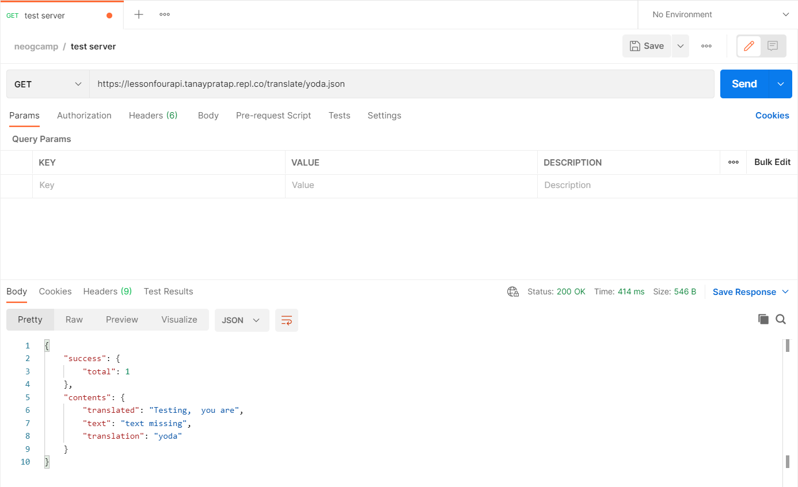
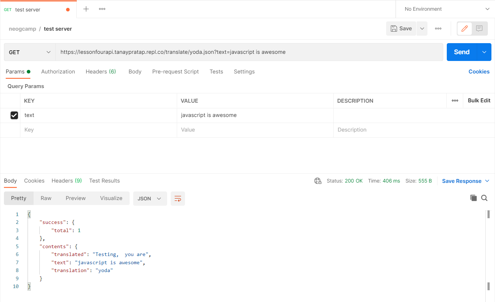
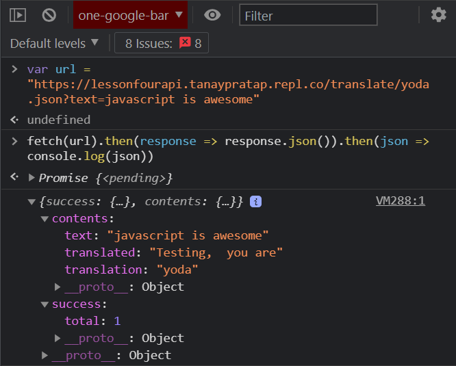
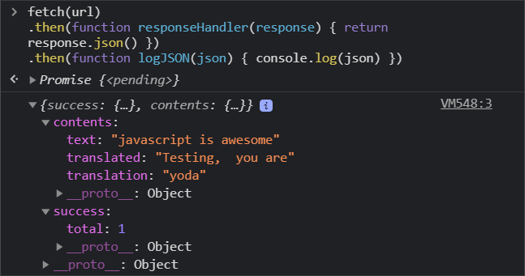
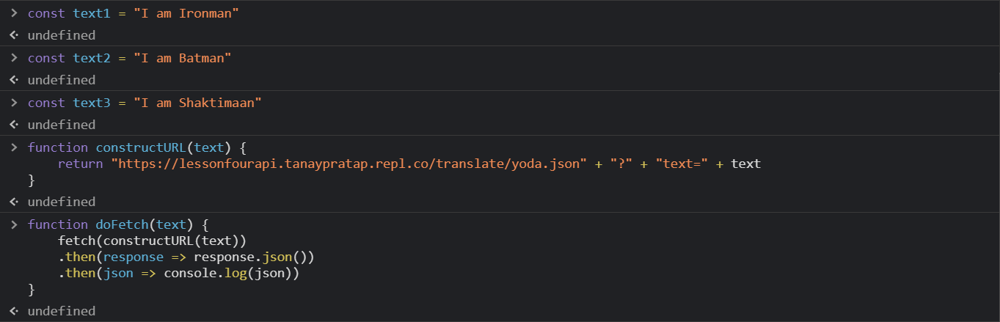
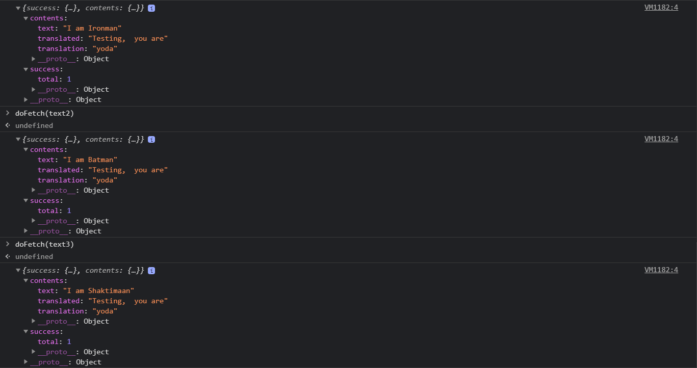
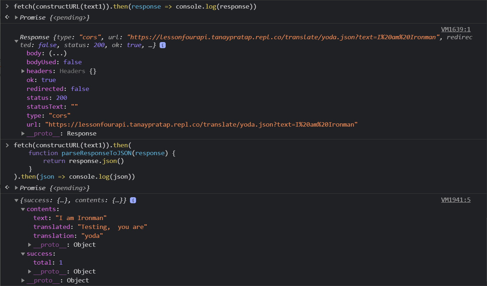

# lesson-four

# javascript in browser or vanillaJS

The name "javascript in browser" is super funny. JavaScript was exclusively for browser before node came along. Since we started our first class using a CLI app which was run using node, this name is needed to differentiate.

---

# what are we going to cover?

1. Attaching events to HTML elements
2. Taking user input in browser
3. `querySelector()`
4. Showing ouput in browser
5. Making network calls to get relevant data.
6. Error handling network calls

# what do you need for this class?

1. VSCode or any code editor.
2. Git to track your changes
3. Browser to run your app, chrome preferred.
4. [PostMan](https://www.postman.com/) to test the API call

# ex01: setup

1. create a new repo
2. initialize index.html file
3. put title, heading in place.
4. initial commit, publish repo.

---

# ex02: using javascript

## understanding

1. Two ways of using JS on client
2. `alert` and `prompt` for output and input

## challenge

1. use external JS
2. show prompt to get user data
3. show alert box to give user output

## code:

```javascript
// input
var username = prompt("Give me your username:");

// processing
var welcomeMessage = "this script works!! " + username;
alert(welcomeMessage);
```

---

# ex03: wiring button click

## challenge

1. create a button in html
2. reference Button using `querySelector()`
3. add event listener to button
4. console "clicked" on click.

## understanding

1. `querySelector()`
2. `.addEventListener("click", callback)` and click events
3. concept of callbacks in javascript

## code:

```javascript
var btnTranslate = document.querySelector("#btn-translate");
// console.log(btnTranslate)

btnTranslate.addEventListener("click", clickEventHandler());

function clickEventHandler() {
  console.log("clicked!");
}
```

---

# ex04: wiring textarea input

## challenge

1. put a textarea input tag.
2. reference that in javascript.
3. read the value of the tag. You can do this only inside event. There are two events which you can listen to

   1. onchange on textarea, we will learn this method in next class while doing React
   2. onclick on button, let's do this now.
      console this value to complete the exercise. refresh and try few more times.
      understanding

4. console this value to complete the exercise. refresh and try few more times.

## understanding

Every element on the page is represented as a property of an object. Remember objects? Think of it like this:

```javascript
/**
 * this is just for simplification and understanding
 */
var htmlPageObject = {
  "input-text": <textarea></textarea>,
  "input-btn": <button></button>,
};
```

This object is called `Document Object Model (DOM)` as it models the entire HTML document in an object. And thus, to access those properties we use methods like `document.querySelector()`.

If this seems too much to understand, ignore it, come back to it after you have done some web dev. A lot of experienced devs too don't know about it. Knowing is definitely better.

Everything you do on a web page triggers an event. There are multiple events like `onscroll` `onsubmit` etc. and knowing about it will help you respond to user's needs. The more web dev you do, the more you'll know about these.

Good thing about these events is that you can plug your own `callback` or functionality in each of these and introduce custom behavior. Think of the animation shown when user starts scrolling.

# live exercise: querySelector

`querySelector()` works on the principles of CSS selectors. It selects and returns the first element which matches the query.

You can open [this mdn doc](https://developer.mozilla.org/en-US/docs/Web/CSS/CSS_Selectors) for reference. And then let's do some exercises.

What will be the query you would write for each one below? Select the first...

1. ... `textarea` tag.
2. ... element with a class `btn-primary`.
3. ... element with an id `input-btn`.
4. ... `input` element with an attribute `name='translator'`.

## code:

```HTML
<!DOCTYPE html>
<html lang="en">
  <head>
    <meta charset="UTF-8" />
    <meta http-equiv="X-UA-Compatible" content="IE=edge" />
    <meta name="viewport" content="width=device-width, initial-scale=1.0" />
    <title>banana talk</title>
    <style>
      textarea {
        width: 90%;
        height: 10vh;
        display: block;
        margin: 1rem;
        padding: 1rem;
      }
    </style>
  </head>
  <body>
    <h1>talk banana</h1>
    <textarea
      id="txt-input"
      placeholder="put your sentence in English here & we will convert it to banana"
    ></textarea>
    <button id="btn-translate">Translate</button>
    <script src="app.js" type="text/javascript"></script>
  </body>
</html>

```

```javascript
var btnTranslate = document.querySelector("#btn-translate");
var txtInput = document.querySelector("#txt-input");

// console.log(txtInput)

btnTranslate.addEventListener("click", clickEventHandler);

function clickEventHandler() {
  console.log("clicked!");
  console.log("input: ", txtInput.value);
}
```

```javascript
// live challenge queries
var textArea = document.querySelector("textarea");

console.log(textArea);
var btnPrimary = document.querySelector(".btn-primary");

console.log(btnPrimary);
var inputBtn = document.querySelector("#input-btn");

console.log(inputBtn);
var nameTranslator = document.querySelector("[name=translator]");

console.log(nameTranslator);
```

```HTML
<!DOCTYPE html>
<html lang="en">
  <head>
    <meta charset="UTF-8" />
    <meta http-equiv="X-UA-Compatible" content="IE=edge" />
    <meta name="viewport" content="width=device-width, initial-scale=1.0" />
    <title>banana talk</title>
    <style>
      textarea {
        width: 80%;
        height: 10vh;
        display: block;
        margin: 1rem;
        padding: 1rem;
      }
    </style>
  </head>
  <body>
    <h1>talk banana</h1>
    <textarea
      id="txt-input"
      placeholder="put your sentence in English here & we will convert it to banana"
    ></textarea>
    <button class="btn-primary" id="btn-translate">Translate</button>

    <div style="font-size: larger">Output will come here 👇</div>

    <script src="app.js" type="text/javascript"></script>
  </body>
</html>

```

```javascript
var btnTranslate = document.querySelector("#btn-translate");
var txtInput = document.querySelector("#txt-input");

btnTranslate.addEventListener("click", clickEventHandler);
```

---

## read more

1. Knowing this is extremely useful in web development. Useful in JS, in CSS and also in automated unit, integration and e2e testing.

2. More about `querySelector()` on this [mdn doc](https://developer.mozilla.org/en-US/docs/Web/API/Document_object_model/Locating_DOM_elements_using_selectors).

3. bonus blog: write a blog about the selectors. Have some complex quizzes to test the learning.

---

# ex05: wire a div to show output

## challenge

1. create an output `div`
2. reference it in js
3. use `innerText` to write to this div dynamically when button click happens

# understanding

1. `innerText` writes text.
2. `innerHTML` write HTML directly.
3. there are other methods like
   creating a DOM element using `document.createElement()`,
   or using `document.createTextNode()` to create textNode,
   and then insert it using `insertBefore()` and `appendChild()`. Explore these pieces and write blogs on it when you understand this.

---

# bonus homework

We did CLI exercies around [leap year](https://handbook.neog.camp/guide/exercise-one) and [prime numbers](https://handbook.neog.camp/guide/exercise-two). For practice you should make both these apps now in browser. It would be much more visual and easy to use! :)

---

# what next?

We have a JS app which takes user input, does processing and then shows an output! This is essentially what `most apps do`.

Think of `posting a status on facebook`. It takes your status via input box, you press post button and then it shows the posted status below in the newsfeed.

However, it does one thing more:` making a call to server`. Server is where you do heavy processing, it's the place where you can save your data. This is the reason when you post something from your laptop you (and others) can see it on their mobile i.e. other clients too.

This is called `client server architecture` in short. Client requests data, and or submits data. Server maintains data.

We'll learn how to make full fledged servers with data maintenance in levelOne where the training will be around `full stack development`.

Meanwhile, there are some BaaS (Backend as a Service) which you can explore to store your data, and do processing without setting up anything. See [Firebase](https://firebase.google.com) and [AWS Amplify](https://aws.amazon.com/amplify/). These are two are the best and are most used in industry.

For now, we will see how to make a network call from the browser and talk to server.

---

# ex06: call a mock server (from Postman)

## challenge

1. Welcome Postman the industry standard GUI to test backend APIs by FE devs.
2. Make sure that this server is up: [tanay test server](https://lessonfourapi.tanaypratap.repl.co/translate/yoda.json)
3. Fire a request from Postman to this api with query `text="testing"`
4. check that output has text, translated text and other fields.

## understanding

1. Read about HTTP methods: GET, POST, PUT, DELETE etc.
2. The call we are making is a GET call. It's used to get data from server
3. We are using a mock API as the translation API is rate limited to 5 per hour.

# live exercise

Call the server above with different text and see the contents of text reflect back on what you sent.

Does this work for you?

# process





---

# ex07: call a mock server (from JS)

## challenge

1. Use `fetch()` in your browser to call the server from JavaScript.
2. Use browser console to test this out.
3. Change output and test again.

## understanding

1. Fetch is built in all modern browsers and can be used to talk the servers.
2. Earlier `xhr` was used extensively, you can read about it online.
3. Browser console is a good place to test something.







---

# ex08: understand promises

`fetch()` call is essentially returning a promises. It says that you can go ahead with the execution and don't wait on me, I'll let you know when I get the data.

This is extremely imporant in browser. You don't want your user to not be able to click on something, or everything to stop when browser is getting data. This is `asynchronous programming`.

How would we tell `fetch()` what do with this data? By giving it a callback inside the `.then()` of promise.

`NOTE` Async programming, event loop, callbacks, promises etc. these things take time to wrap our heads around. However, these are important concept. You don't need to understand it right away, concentrate on programming apps for now. But before going to any interview, make sure you know these.

---

# ex09: wire fetch call in app

## challenge

- move the fetch call to fire when button clicked
- parse the data from the output.
- update the output from .then() of the fetch call

## understanding

- server responses are never the only thing which you need. there's always extra data and information around. this is why POSTMAN and documentation tools like SWAGGER are useful for FE devs.

`BONUS`: Look into `encodeURI()` and use it to make sure the URL is encoded. Learn why encoding is needed.

## code :

```javascript
var btnTranslate = document.querySelector("#btn-translate");
var txtInput = document.querySelector("#txt-input");
var outputDiv = document.querySelector("#output");

var serverURL = "https://lessonfourapi.tanaypratap.repl.co/translate/yoda.json";

function getTranslationURL(text) {
  return serverURL + "?" + "text=" + text;
}

function clickEventHandler() {
  // outputDiv.innerText = 'ehehehehehehehe ' + txtInput.value
  var inputText = txtInput.value; //taking input

  fetch(getTranslationURL(inputText))
    .then((response) => response.json())
    .then((json) => console.log(json.contents.translated));
}

btnTranslate.addEventListener("click", clickEventHandler);
```

---

# ex10: error handling

## challenge

- make sure that API error is handled

## understanding

- `.catch()` takes a callback and error is passed to as an argument to the callback.
- API errors are not rare, knowing how to handle errors are useful when the data is coming from server.

## code:

```js
var btnTranslate = document.querySelector("#btn-translate");
var txtInput = document.querySelector("#txt-input");
var outputDiv = document.querySelector("#output");

var serverURL = "https://lessonfourapi.tanaypratap.repl.co/translate/yoda.json";

function getTranslationURL(text) {
  return serverURL + "?" + "text=" + text;
}

function errorHandler(error) {
  console.log("error occured", error);
  alert("something wrong with server! try again after some time");
}

function clickEventHandler() {
  // outputDiv.innerText = 'ehehehehehehehe ' + txtInput.value
  var inputText = txtInput.value; //taking input

  fetch(getTranslationURL(inputText))
    .then((response) => response.json())
    .then((json) => console.log(json.contents.translated))
    .catch(errorHandler);
}

btnTranslate.addEventListener("click", clickEventHandler);
```

---

# ex11: replace the mock url

## challenge

- find the URL on https://funtranslations.com/

- when everything works just replace the URL with the actual.

## understanding

- sometimes you work with mock APIs and then use PROD API in production. this is a good practice for that. generally, in real life we have `env` variables which tells the software where it is hosted and depending on the environment the API and many other settings are used.

- think of payment site, to test it while developing will the developer always use real credit card to test the site? No, that's why there are fake CC.

## code:

```js
var btnTranslate = document.querySelector("#btn-translate");
var txtInput = document.querySelector("#txt-input");
var outputDiv = document.querySelector("#output");

// var serverURL = 'https://lessonfourapi.tanaypratap.repl.co/translate/yoda.json'

var serverURL = "https://api.funtranslations.com/translate/minion.json";

function getTranslationURL(text) {
  return serverURL + "?" + "text=" + text;
}

function errorHandler(error) {
  console.log("error occured", error);
  alert("something wrong with server! try again after some time");
}

function clickEventHandler() {
  // outputDiv.innerText = 'ehehehehehehehe ' + txtInput.value
  var inputText = txtInput.value; //taking input

  fetch(getTranslationURL(inputText))
    .then((response) => response.json())
    .then((json) => {
      var translatedText = json.contents.translated;
      outputDiv.innerText = translatedText; // output
    })
    .catch(errorHandler);
}

// understanding callback functions
// function catch(callbackfn) {
//   // do something
//   // something more
//   callbackfn(error)
// }

btnTranslate.addEventListener("click", clickEventHandler);
```

---

# bonus exercise: style it up

See the styling of https://bananaspeakpractice.netlify.app/ and make your app look pretty like this.

The best way to style the app like this is to start from scratch and remove any styling we have done during this video.

Solution:

Look for the `style.css` file for custom styling.

The final result can be seen directly on the app's [website](https://banana-talk-neogcamp.netlify.app/). 

# assignment

- `markSix`

GitHub Repository - https://github.com/horsemaker/banana-talk

Website Link - https://banana-talk-neogcamp.netlify.app/

- for `markSeven` take any of the translation APIs on the website and use it to create your own fun translation app. Give it your own style, maybe use some SVGs. Give it your own flair.

GitHub Repository - https://github.com/horsemaker/what-would-shakespeare-sayeth

Website Link - https://what-would-shakespeare-sayeth.netlify.app/

### Takeaway:

1. browser events in javascript.
2. Book - Eloquent JS https://eloquentjavascript.net/
3. https://developer.mozilla.org/en-US/docs/Web/CSS/CSS_Selectors
4. querySelectorAll