# lesson-two

# host your first website

`Objective`: Host your first website. In order to do that, we will learn

- how Git works,
- how Github works,
- how to use VSCode like a pro,
- how to host your website for free online,
- how to work like a professional with all these tools

---

# how this works

If you have done lecture 01, you know that this will be a series of mini exercises.

Think of this as you watching me playing a game. Take notes on how I cross each level. Then go ahead and close this video, and using the companion guide, play it yourself.

---

# why this way?

You might have heard the term, "MUSCLE MEMORY". Well there's no such thing as that. But there's something called myelin. Research has found out that to be good at something you need a lot of myelin at that skill forming neurons.

And mylein comes only when you try to retrive. Try to fetch something from your memory. By just seeing the screen and typing you are not fetching anything from your memory. However, if you do it the right way you'll learn and develop the skill!

This is the reason why you are viewing 100s of tutorials online but go blank when you have to develop something of your own, or when you go to an interview.

From past one year, I have read extensive research on cognitive science, even wrote my own paper, and if you want to be the best of the best, give yourself some hard time.

`No pain, no gain`.

---

PART ONE: SETTING UP GIT and GITHUB

# ex01: explain to a 10 year old what is git

## challenge

Without using any technical term can you explain what is git? Why do we need it? In the simplest terms?

If you don't have someone to explain, maybe tweet or put a LinkedIn status about it.

## understanding

- what, who and when was done something to code
- If you can explain it to a 10 year old, you know it.

---

Solution:

---

# ex02: intialise a git repo

## challenge

- Using github desktop initialise a git repo.

## understanding

- multiple choices, around README, .gitignore, LICENSE. To get started chose the default options.
  homework:
- Read about open source LICENSE. Explore LICENSE of some famous open source repositories

---

Solution:

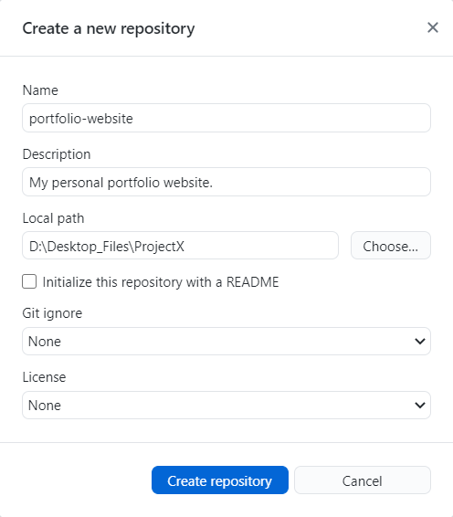

---

# ex03: create a file in the repo

## challenge

- Open this repo in Visual Studio Code
- Create a file `index.html`.
- See the changes

## understanding

- green is added
- red is removed
- `+` is file added

---

Solution:

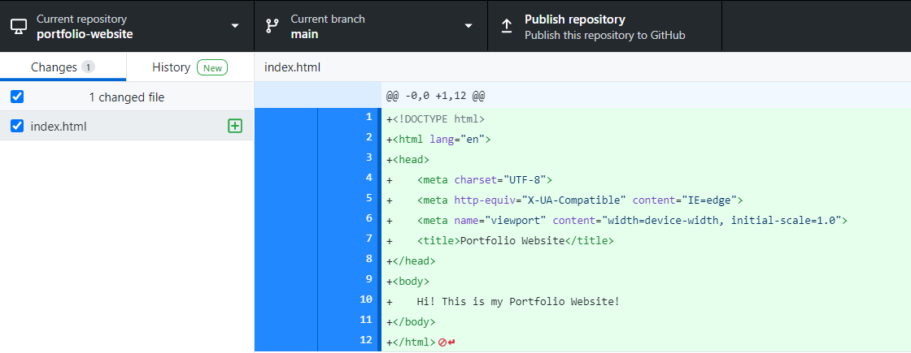

---

# ex04: commit your first changes

## challenge

- Add a commit message
- Commit to main branch.

## understanding

```
    commit
    main
```

---

Solution:

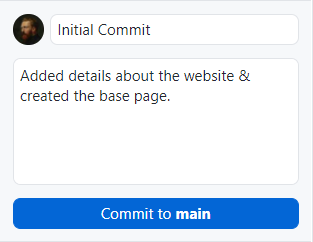

---

# ex05 : understanding commit messages

## understanding

Writing good commit message is a skill. Let's understand this.

```
feat - a new feature
fix - a bug fix
docs - changes in documentation
style - everything related to styling
refactor - code changes that neither fixes a bug or adds a feature
test - everything related to testing
chore - updating build tasks, package manager configs, etc
```

Use this to start the message. Like if we added test for a function which checks leap year, we start with test. Then in short describe the work we did

```
test: add unit test for leapYearCheck()
```

## note

We don't do it right all the time. But it's good to put some thought in commit messages. Look into commit messages of open source work on Github to get some inspiration.

But don't get overwhelmed with this.

# live exercise: write a good commit message

## challenge

Q. What would you put as a commit message if:

1. You added some details to the README.md file?
2. Your CLI app was taking "potato" as an input for leap year test?
3. You started using CHALK library in your CLI app?
4. You added level based game play in your CLI app?
5. You renamed your variables from var a to var questions?

Solution:

1. docs: updated README
2. fix: validating input for leap year
3. style: added CHALK for CLI app
4. feat: added level based game play in the CLI app
5. refactor: renamed variable 'a' to 'questions'

---

# exercise 06: publish to github

## challenge

- publish your repository to Github
- go to github.com and see your repository

## understanding

- we use Github to host and save the code in a centralised location

* there are other tools like Github: Azure DevOps, BitBucket, Gitlab etc.
* major use is for collaboration. Apart from personal projects, people generally work in a team.

Solution:

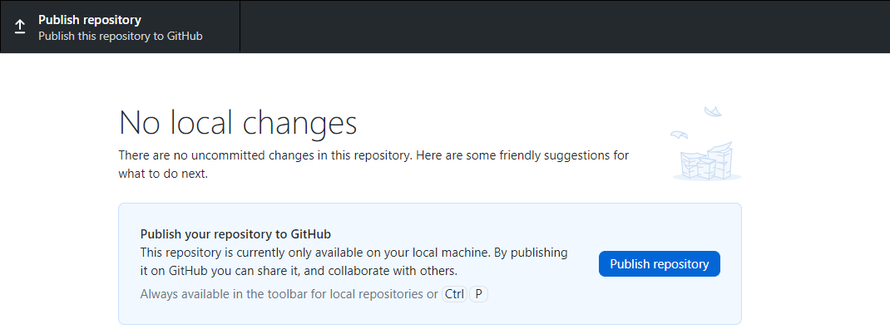

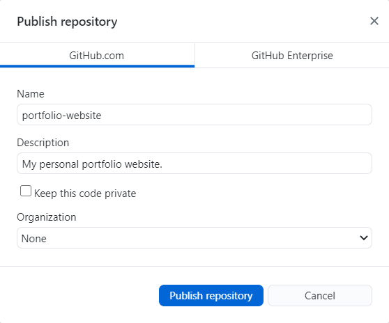

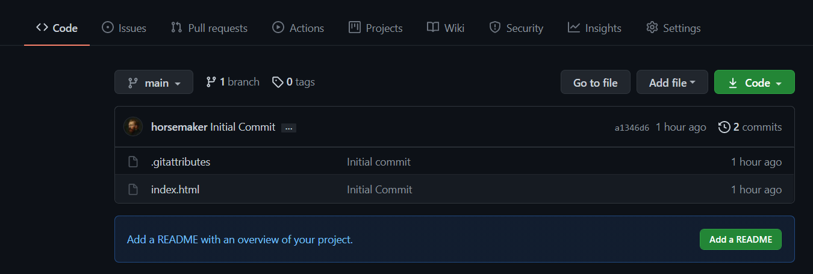

---

# live exercise: add readme and commit

## challenge

- create a file README.md
- add details of your project on the file. Say, that this is your personal portfolio in making. Some details about you.
- commit the changes (let's see what commit message you're going to use)
- push the changes to Github
- go to Github and see your changes now

## understanding

- push
- markdown
- how README.md is special

Solution:

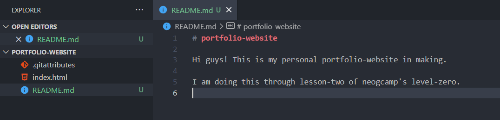

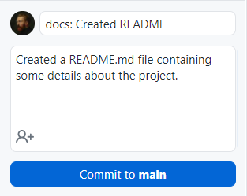

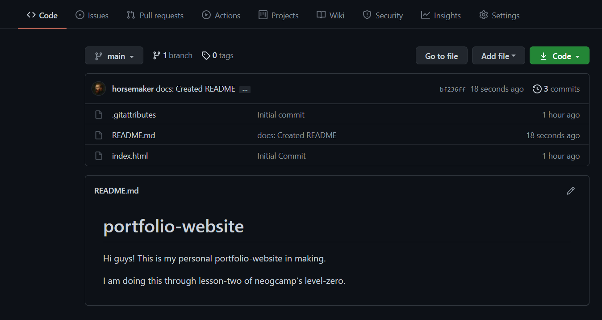

---

revision

- By now you know how to
- why git
- create a repo
- publish repo
- make commits
- write good commit messages
- push commits to server
- some markdown for documentation

---

PART TWO: SETTING UP NETLIFY

# ex01: Explain how Internet works

## understanding

- domain name
- server (files served)
- hosting
- client

---

# ex02: setup netlify to show your website

## challenge

- Sign up to netlify using your Github login.
- Select new site from repository
- Select your Github repository

## understanding

- there are other providers like Netlify: Azure, AWS, Heroku etc. and you can explore them.
- everytime you change something on the website it will be published automatically

Solution:

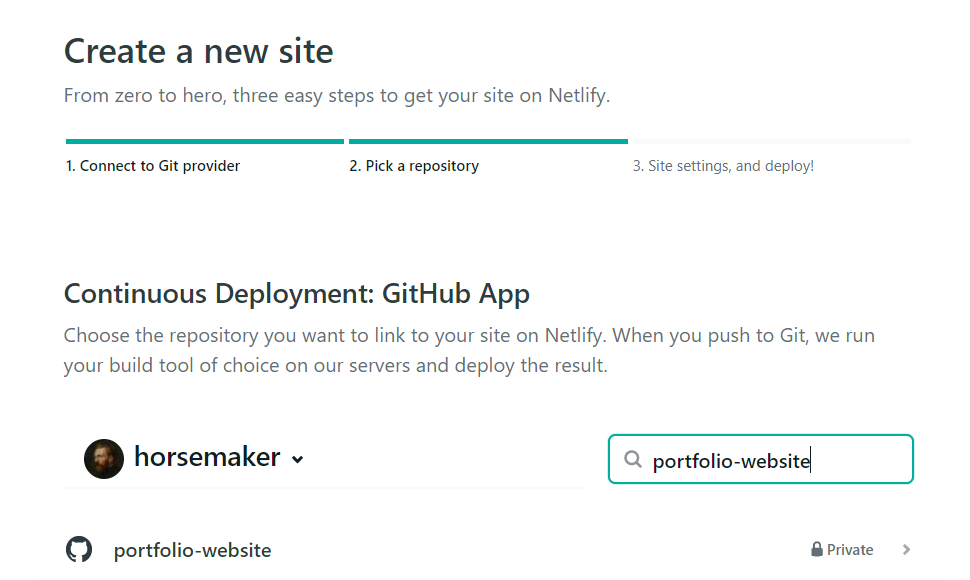

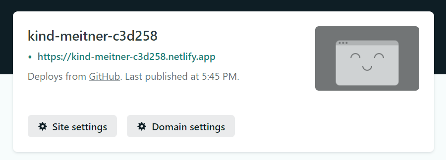

---

# ex03: check deploy

## challenge

- explore the deploy section of Netlify

## understanding

- this section shows all the deployments done with history

Solution:

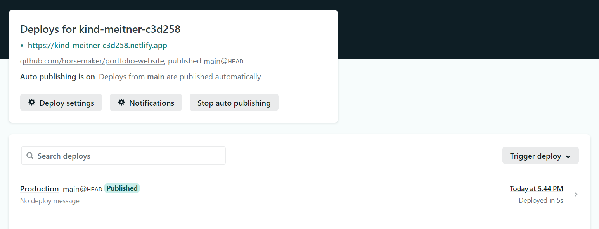

---

# ex04: change domain name

## challenge

- the domain name provided is random, change it to your name
- use this to access your web app and share it with your friends.

Solution:

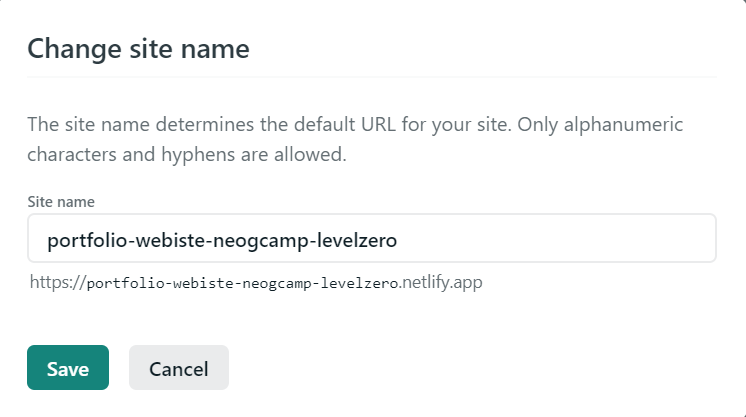

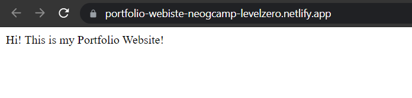

---

# live test: local to website

## challenge

- do a change in your VSCode, add some text to your index.html file. Anything which makes some sense, like, I work at Microsoft or I study at MIT, Manipal.

* commit
* push
* go to Github and check if you can see the change in index.html on github.com
* go to Netlify and check if your changes are deployed. Look for the timestamp.
* finally, go to your website and check if new changes are there.

Solution:

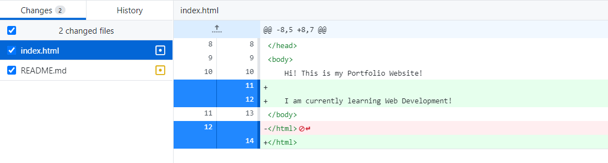

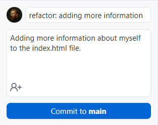

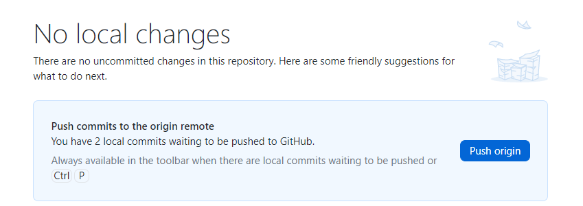

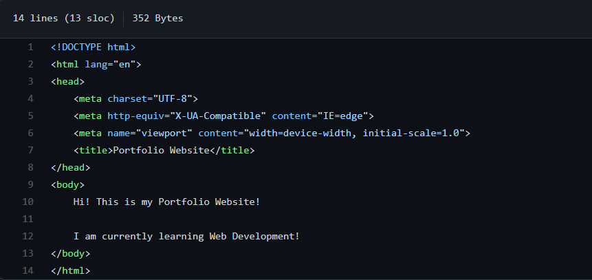

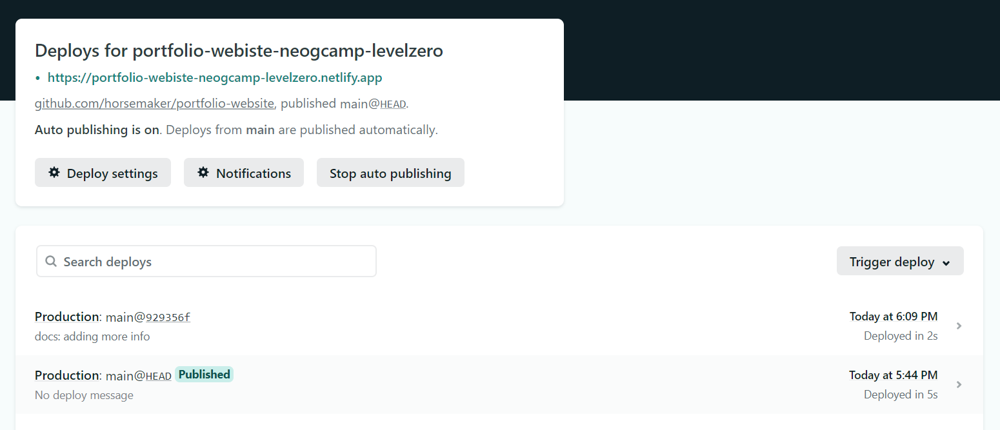

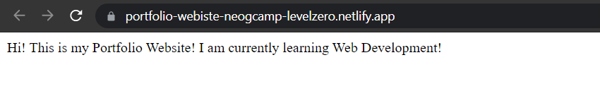

---

# live test: update the URL on Github

## challenge

- github has a place where you can put your URL of your website. add it there.

Solution:

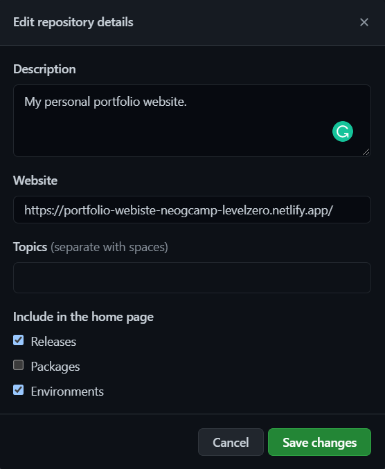

---

PART THREE: SETTING UP VSCODE

# ex01: take a tour of vscode

## challenge

- know where file explorer is
- checkout search section
- extensions
- source control
- settings (Ctrl + ,)
- shortcut

---

# ex02: try some shortcuts

## challenge

- Let's see if you can do these things. Look once and then try yourself.

* show/hide terminal
* show/hide sidebar
* open file
* command pallete
* jump to line number
* jump to symbol
* toggle wrap

Note: You don't need to know everything. But I suggest try to use shortcuts as much as possible, it saves ton of time.

---

PART FOUR: GETTING INTO THE DEV WORKFLOW WITH ALL THE SETUP

# ex01: knowing how a dev in team works?

- you see what happens when you push the changes to server when Netlify is connected: it goes live
- so, how would you save your unfinished work? keep it on laptop? no!!
- a developer in any team creates her branch for new work
- she does all the work in that branch and pushes that branch
- when work is done, she raises a PR (Pull Request) which is approved by other team members and then it goes to master.
- it's a good practice to follow even when you're working as a single person. this keeps your main free for hotfixes.

## challenge

- Try visualising yourself working in a team of developers. Everyone working on different features, different branches, but all goes into the same website. :)

---

# ex02: create a branch

## challenge

- create a new branch
- name it yourname/project-details
- verify that you're in new branch

## understanding

- branch is a separate route, think of it as taking a diversion from main road, getting petrol while you're on a long road trip.
- then you go back to the main road with petrol in your car
  getting petrol is a feature which you implemented :)

Solution:

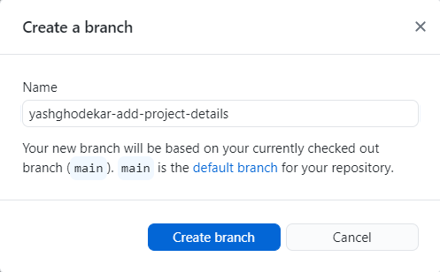

---

# ex03: do changes in this branch

## challenge

- edit the index.html file. Add details about the projects you have made.
- commit your changes. notice that changes are committed in new branch.

* push. it will be pushed to this new branch
* go to github and check if your file has changed
* go to netlify and check if there's a new deploy
* go to website and check if the new text is up
* now explore the branch section on github and see your changes in that branch

## understanding

- pushing changes to a branch does not publish it to Netlify
- this way, you can keep your work in progress safe on github

Solution:

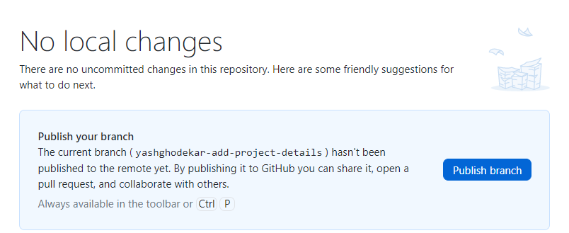

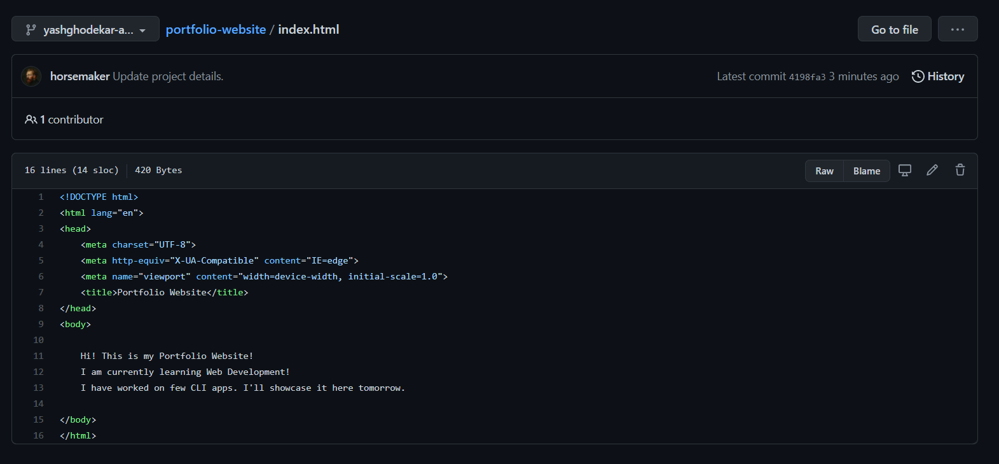

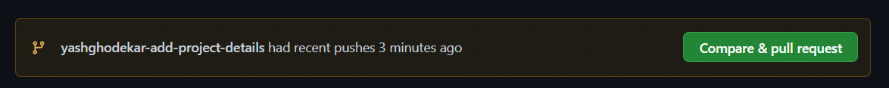

---

# ex04: open a PR

## challenge

- create a pull request for your new branch
  fill in description and headline

* check out the file changes
* get the PR link. you can send this for review to your friend to make sure that you're doing the right changes. That would essentially be PR review

## understanding

- PR review, important when you're working in a team

Solution:

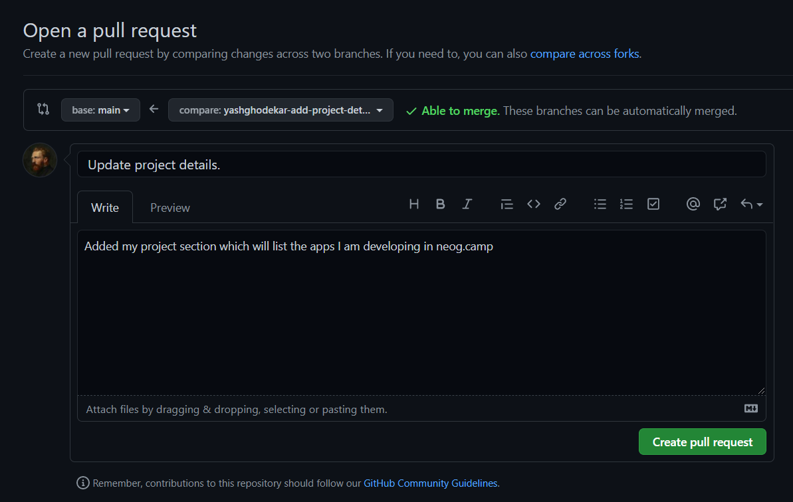

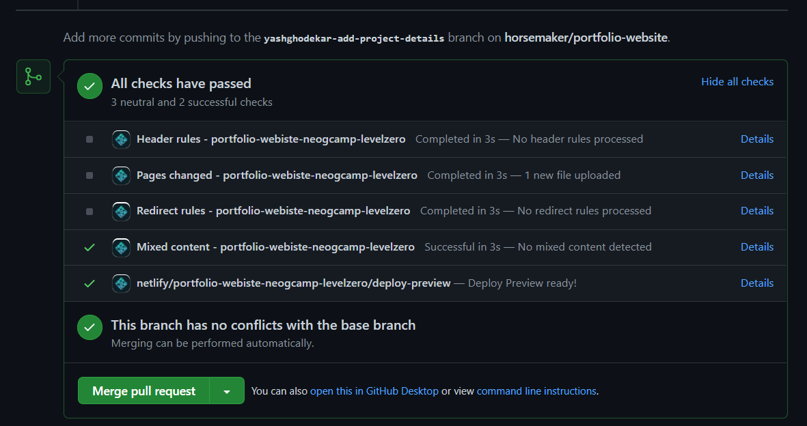

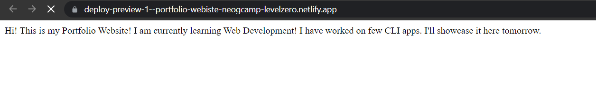

---

# ex05: merge PR

## challenge

- merge the PR which you just made
- now, check your changes on
  1. main branch
  2. deploy in Netlify
  3. update on website

Solution:

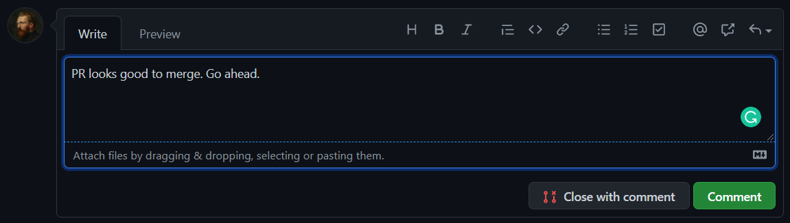

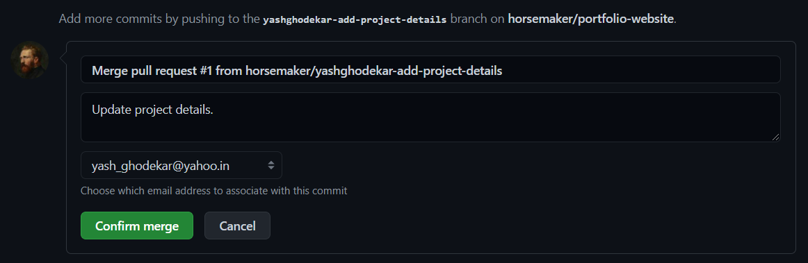

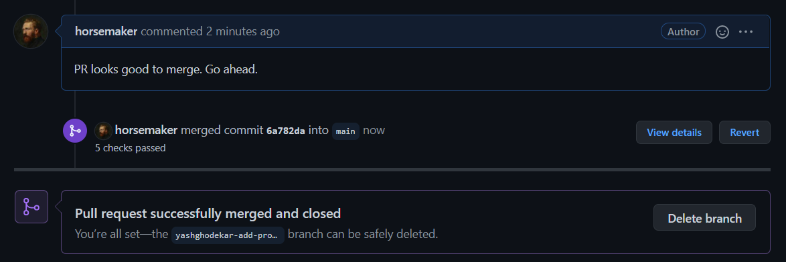

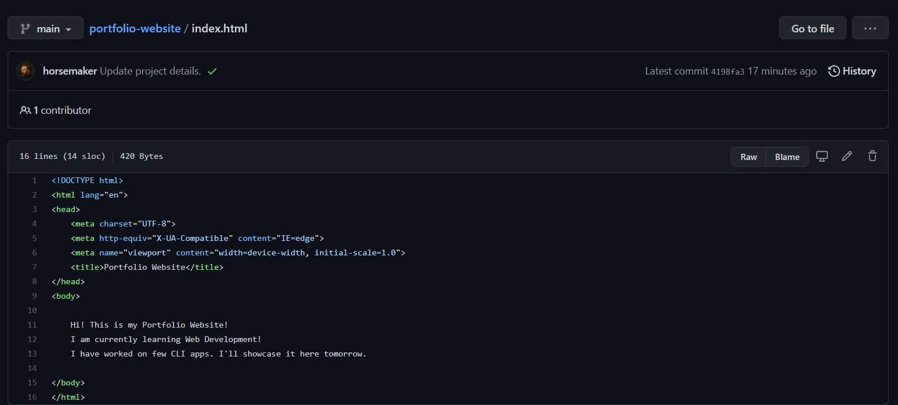

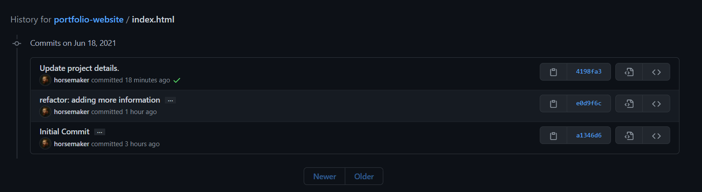

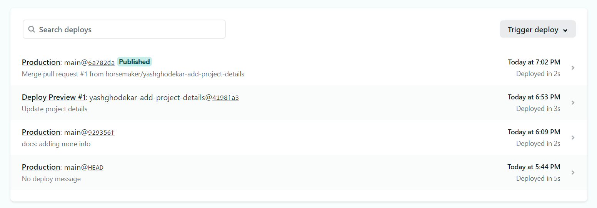

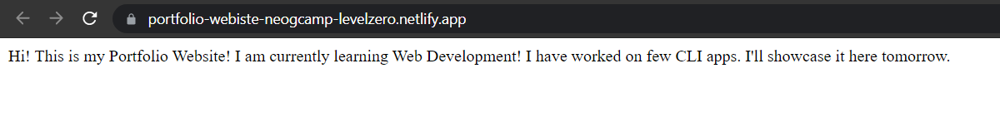

---

# ex06: going back to main

## challenge

- now your changes are part of main
- go back to main and pull the changes

## understanding

- this might look weird when doing alone
- think you're working in five member team, to make sure that TeamMate03 receives changes of TeamMate02 and TeamMate01, she should pull master often.

* an important practice when you're working in industry

Solution:

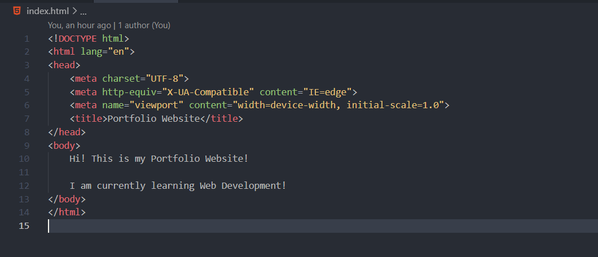

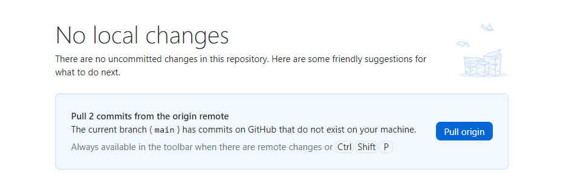

---

# live exercise: do the entire thing

## challenge

- make sure you're in main
- create a branch, make changes to index.html file. Add details of your favorite book/movie etc.
- push the new branch to Github.
- create a PR, fill details.
- merge PR and see your changes reflect.

Solution:

Check all the above content to know the entire thing.

---
